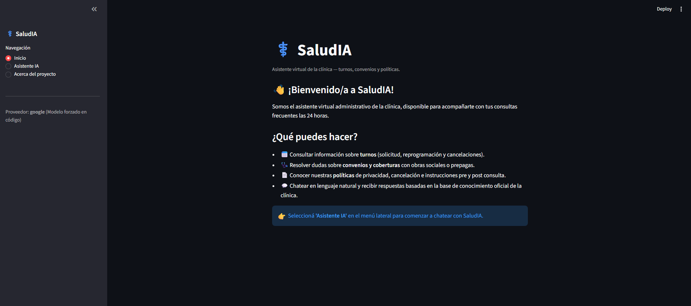
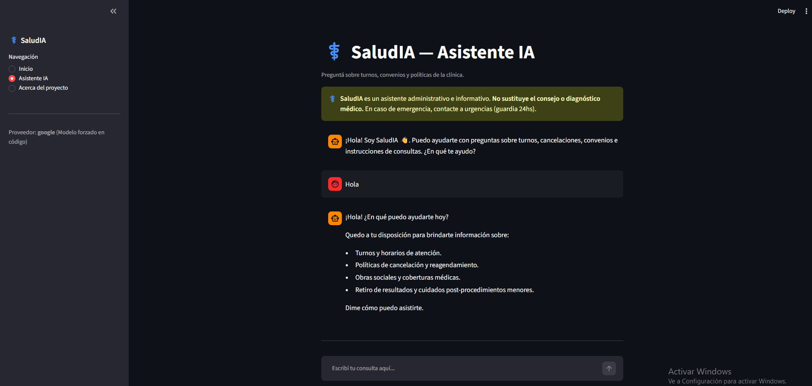
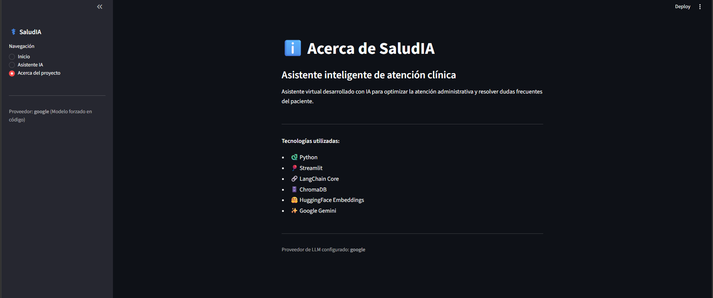

# SaludIA ⚕️

**SaludIA** es un asistente inteligente desarrollado con Python, Streamlit, LangChain Core, ChromaDB y Google Gemini, capaz de responder preguntas administrativas de pacientes utilizando una base de conocimiento interna de la clínica mediante la técnica *Retrieval-Augmented Generation (RAG)*.

---

## Descripción

El objetivo de este proyecto es demostrar cómo la Inteligencia Artificial puede utilizar una base de conocimiento específica de una clínica de salud para responder preguntas de forma precisa, contextualizada y segura, sin sustituir en ningún momento el consejo o diagnóstico médico.

El sistema procesa documentos internos (políticas, FAQs, convenios), genera embeddings mediante modelos de *Sentence Transformers* (HuggingFace), almacena la información en una base vectorial utilizando ChromaDB y emplea Google Gemini para generar respuestas únicamente con el contexto recuperado, evitando por completo el módulo `langchain.chains` mediante una cadena RAG 100% nativa con `RunnableLambda`.

---

## Características

- 📄 Lectura y fragmentación de documentos internos de la clínica (`.txt`).
- ✂️ División automática del contenido en fragmentos (*Chunks*).
- 🧠 Generación de embeddings mediante Sentence Transformers (HuggingFace, 100% local).
- 🗄️ Almacenamiento de información en ChromaDB.
- 🔍 Recuperación semántica de información (*Retriever*).
- ✨ Generación de respuestas con Google Gemini, restringidas al contexto recuperado.
- ⚠️ Disclaimer médico siempre visible: nunca da diagnósticos ni indica tratamientos.
- 🧭 Interfaz gráfica desarrollada con Streamlit, con navegación por pestañas:
  - **Inicio** — bienvenida y resumen de servicios (turnos, convenios, políticas).
  - **Asistente IA** — chat conversacional con historial persistente.
  - **Acerca del proyecto** — información técnica del asistente.
- 💾 Historial de conversación persistente en `st.session_state`, se mantiene intacto al navegar entre pestañas.

---

## Arquitectura

```
Usuario
    │
    ▼
Interfaz (Streamlit — Inicio / Asistente IA / Acerca del proyecto)
    │
    ▼
Retriever
    │
    ▼
ChromaDB
    │
    ▼
Contexto Recuperado
    │
    ▼
Google Gemini
    │
    ▼
Respuesta
```

---

## Estructura del proyecto

```
saludia/
│
├── data/                              # Documentos fuente (.txt)
│   ├── 01_politica_privacidad.txt
│   ├── 02_faqs_turnos.txt
│   ├── 03_politica_cancelaciones.txt
│   ├── 04_convenios_coberturas.txt
│   └── 05_instrucciones_pre_post_consulta.txt
│
├── src/
│   ├── processor.py                   # Ingesta: carga, chunking y vectorización en ChromaDB
│   └── app.py                         # Interfaz Streamlit + cadena RAG (navegación por pestañas)
│
├── chroma_db/                         # Base vectorial persistida (se genera automáticamente)
│
├── requirements.txt
├── .env.example
└── README.md
```

---

## Tecnologías utilizadas

- Python
- Streamlit
- LangChain Core (`RunnableLambda`, sin `langchain.chains`)
- ChromaDB
- Sentence Transformers
- Google Gemini
- HuggingFace Embeddings
- Python Dotenv

---

## Instalación

### 1. Clonar el repositorio

```bash
git clone <URL_DE_TU_REPOSITORIO>
cd saludia
```

### 2. Crear un entorno virtual

```bash
python3 -m venv venv
```

**Windows**
```bash
venv\Scripts\activate
```

**Linux / macOS**
```bash
source venv/bin/activate
```

### 3. Instalar dependencias

```bash
pip install --upgrade pip
pip install -r requirements.txt
```

### 4. Configurar la API Key

Crear un archivo `.env` en la raíz del proyecto (basado en `.env.example`):

```env
LLM_PROVIDER=google
MODEL_NAME=gemini-1.5-flash
GOOGLE_API_KEY=TU_API_KEY
```

---

## Construir la base de conocimiento

Ejecutar cada vez que se agreguen o modifiquen documentos en `/data`:

```bash
python src/processor.py
```

---

## Ejecutar la aplicación

```bash
streamlit run src/app.py
```

---

## Navegación de la interfaz

| Pestaña | Descripción |
|---|---|
| **Inicio** | Presentación del asistente y resumen de los servicios disponibles (turnos, convenios, políticas). |
| **Asistente IA** | Chat RAG con historial persistente, disclaimer médico visible y spinner de carga. |
| **Acerca del proyecto** | Información técnica: tecnologías utilizadas y proveedor de LLM configurado. |

---
## Capturas




## Notas de seguridad

- Nunca versionar el archivo `.env` (agregarlo a `.gitignore`).
- Los embeddings se calculan 100% localmente (HuggingFace), sin enviar el contenido de los documentos a terceros; solo las preguntas del usuario y los fragmentos recuperados se envían al LLM (Google Gemini) para generar la respuesta.
- El asistente **nunca** da diagnósticos médicos, indica tratamientos ni interpreta síntomas; ante una posible urgencia, deriva de inmediato a la guardia/urgencias.
- Revisar periódicamente el historial de conversación para detectar preguntas fuera del alcance administrativo y reforzar el prompt o el proceso de derivación a un profesional si es necesario.